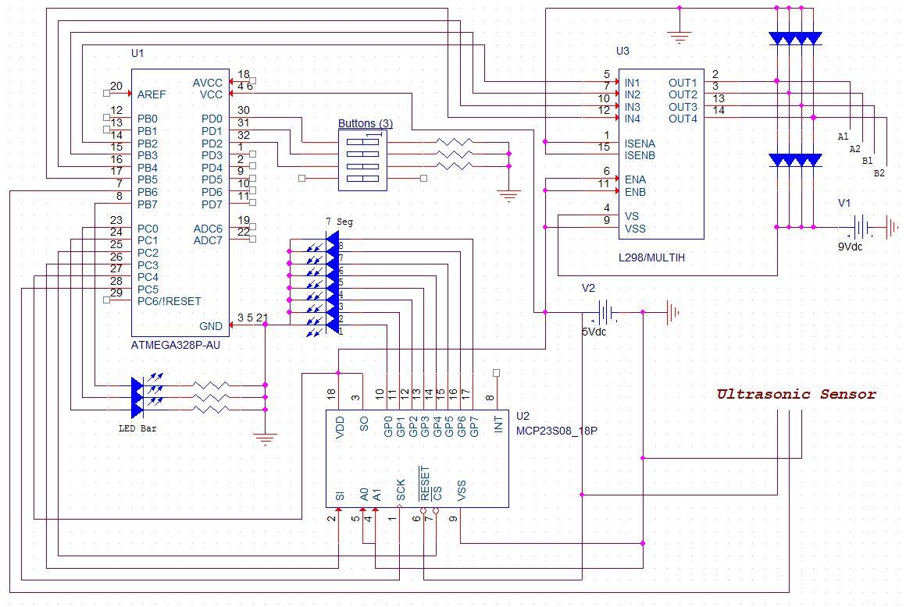

**_Mini Project - Elevator Control _**

**_Tanish Arora_**

**_Leya Zeng _**

**_Project Description_**

This project is based on an elevator system, By using a cookie box and a couple of markers to make the frame for the elevator, a platform is raised to the desired level by the press of a button and stopped by the use of an ultrasonic sensor . A string with a stepper motor is used to pull the platform to each level. Once the platform arrives at the appropriate level, a 7-seg BCD display shows the current level of the platform, and the LED bar would point to the level the elevator is about to reach. The goal of the project essentially was to mimic a real life elevator system, by creation of multiple levels using the markers, and mapping out the right distance using the sensor and the time counter.

**_System Design_**

* **High level block diagram**

 	

**_Implementation Details_**

* **Schematics
**

**
**

* **Parts used**

Arduino ATmega328P (x1)

10 Segment LED Bar (x1)

7 Segment LED Display (x1)

Shift Register (x1)

Tact Buttons (x3)

Ultrasonic Sensor (x1)

L298 Motor Control (x1)

Stepper Motor (x1)

9V Battery (x1)

* **Circuit picture**

* **Flowchart**

* **Code Details:**

    * Lev1 : 

        * It's the main macro for Level 1 for the elevator system 

    * Lev2

        * It's the main macro for Level 2 for the elevator system

    * Lev3 

        * Main macro for Level 3 

    * All the above given macros are decided and changed based on the inputs from both the ultrasonic sensor and buttons. 

    * Library for the ultrasonic sensor: 

        * "Ultrasonic.cpp" : The whole library for the sensor was defined as follows that it uses pin number 6 available on the Arduino board (which fortunately is also a  PWM signal pin), So for every delay time set by the user, it sends a signal(pulse) out through the trigger and waits for the signal to remit back from the solid material in front of the sensor and then do all the calculations in order to return the distance back in centimeters or inches. 

        * This is the main part of our project as all the calculations such as where the lift is at the current time is calculated based on the distance returned from the sensor. 

        * How to call the function: <#include "ultrasonic.h"> , <RangeInCentimeters = ultrasonic.MeasureInCentimeters();>  

        * And this will store the distance in centimeters from the sensor and store in Range in Centimeters variable. Another function created was to return the range in inches. The current accuracy of the code is approx 87-95%. 

* Most of the other parts of the code is pretty straightforward to be honest as it  takes the input from buttons, and sensor at the same time to decide which is the next floor the elevator need to go to and the basic logic of the elevator is implemented. 

* We also used a shift register library (SPI) from arduino, in order to use less pins and have a more efficient way of outputting the current level of the floor on to a 7 segment BCD display. 

* For example, If a person is at Level 3, The person can only either go straight to level 2 or Level 1 or straight to Level 1. Now if while on Level 1, the person wants to go to Level 3 all he needs to do is click Level 3 button, and the stepper motor starts moving and the Lift is pulled upwards by the rotation of the motor. After reaching Level 3 the sensor automatically detects the distance and tells the motor to stop rotating. 

  	**_YouTube Link:_*** **[https://youtu.be/D_inLVeFMl*w](https://youtu.be/D_inLVeFMlw)

**_Testing/Evaluation_**

* **Challenges and problems encountered**
	
	We decided to use the ultrasonic sensor to detect floor range based on distance rather than calculating the rotation of the motor, so team member Tanish had to program the sensor library as it was not provided and with only hardware in hand.
	

We encountered some serious hardware problems, and that gave up a lot of trouble. At first we tested each part separately and they worked fine, but when we connected all parts together at least one part would not behave well. 
Because we tested individual parts first, so that much lowered our suspicions of software issues, and focused more on hardware design and connections.

Motor was working during the test but later on it stopped working, even with a simple rotate test, so the test on the Arduino Board was done and it looked like the board didn’t pass the loopback test, so we had to change the board.

After changing the board things started working again, only hours before the demo the motor stopped working. As there were no change in software, it had to be a hardware problem. We were constantly changing the circuit trying to make it presentable, so we guessed it was some connection problem. We had to take the circuit to the EE-room and use voltage meter and oscilloscope to test each pin on our circuit connections. We did find some part of our circuit was not connected correctly as the voltage did not ‘pass through’ certain parts and had gaps of voltage drops. 

* As a result of the connections:

1. We ran through a brand new 9V battery in half a day, the battery was getting warm, and the L298 motor controller was getting skin-burning hot.

2. When testing the motor, we short out Tanish’s laptop when connected to the positive end of the 9V battery to the board: we heard a small popping sound and the laptop shut down immediately. The laptop was connected to the wall outlet (with charged battery), and the Arduino Board.

After fixing all the possible connection errors, the motor was still not working. Until finally we used the oscilloscope to check the phase of the motor and found that one of the connections of the motor itself (B1) was ‘loss’, as it was shown on the oscilloscope B2 had higher (double) output than B1. That caused the motor not having enough power to turn and it could only oscillate in place. We then switched a motor then finally got it to work.

	

* **Limitations and possible improvements
**

Because we are using the Arduino, we didn't have enough pins to take in a lot of floor numbers, limited at 3 floors. Also with its analog input, we were not able to store multiple floors, for the elevator to go with floors which were pressed in order and stored more than one floor at a time. That would also affected the LED bar for floor pressed indication, that only one pressed floor is shown.

Possible Improvements: We’ve thought about putting buttons on the cookie box along with a single LED, so when buttons were pressed the elevator will go to that floor, and maybe with HCS12-Dragon Board we can make mulit-floor/buttons.

During out test, the ultrasonic sensor was very accurate, so that we could add more floors in to the cookie box and it would still detect the correct floors.Possibly also adding a button queue using FIFO, and for loops to select multiple floors at once, maybe introducing na emergency stop switch using the IRQ interrupt pin from the HCS12 board to prevent any damage to the system implemented. 

**_Roles and Responsibilities of group members_**

* Project topic: Tanish, Leya

* Project design: Tanish, Leya

* Circuit design: Tanish, Leya

* Software design: Tanish

* Software testing: Tanish

* Project testing: Tanish, Leya

* Hardware build: Leya

* Circuit testing: Tanish, Leya

* Circuit debugging: Leya

* Presentation slides: Leya 

* Project Report :  Tanish, Leya

**_Conclusion_**

	We chose the elevator to be our mini-project because it sounds fun and realistic. Throughout this process we improved our software and hardware development  and debugging skills. Focus on the small parts first, go level by level, and based on the feedback and error information find out where the problems occur, and apply appropriate fixes. For the time we had and progressed we made, we are happy that we were able to finish this project had a functioning product in the end. There are places for improvements in our project, we identified them, and had the idea of possible routes to apply the fixes and upgrades, it serves well as a practice of design, develop, build, expand, and debug of a project, and we’ve learned a lot and accumulated some knowledge of working on a project.

